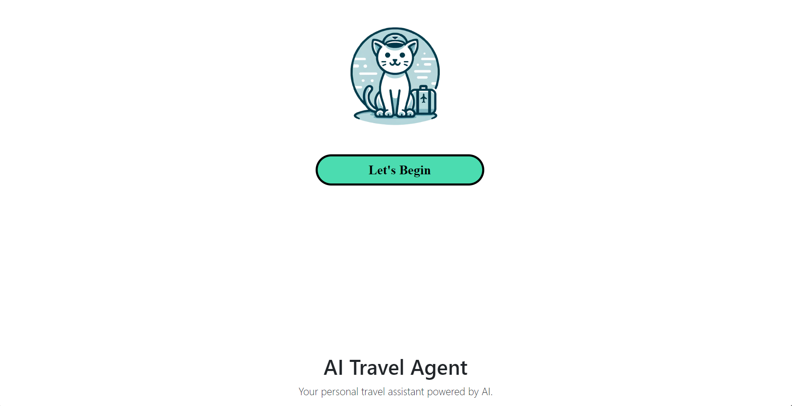
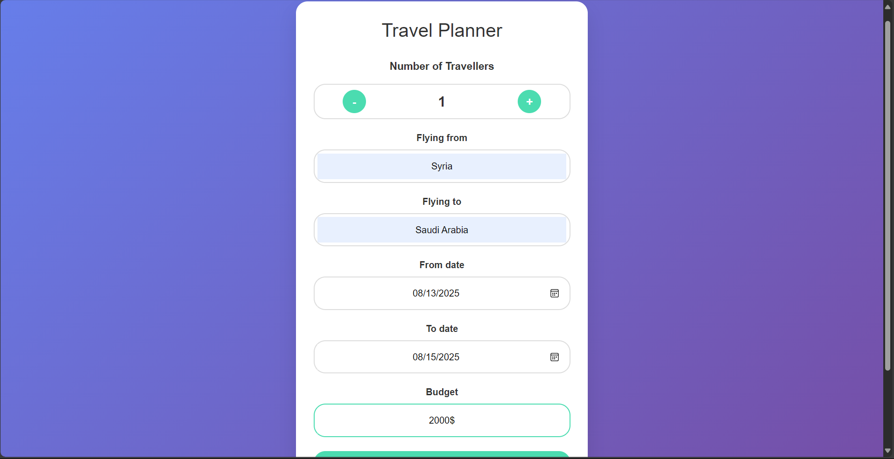
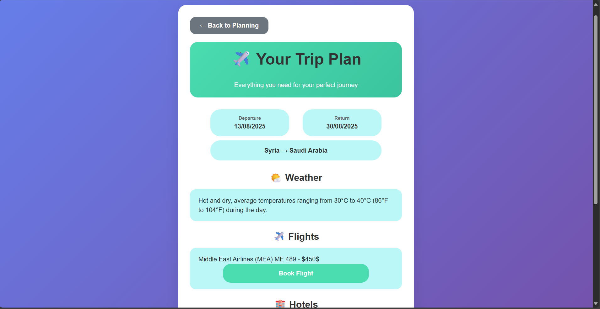
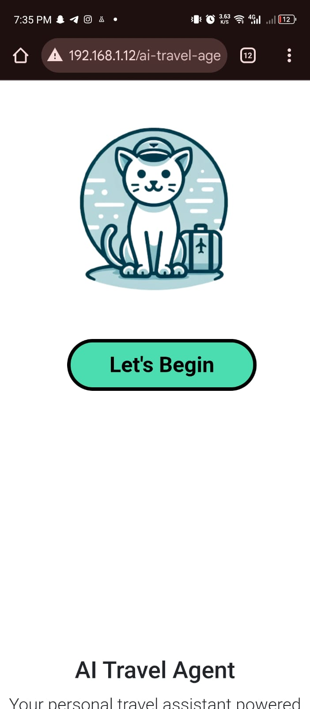
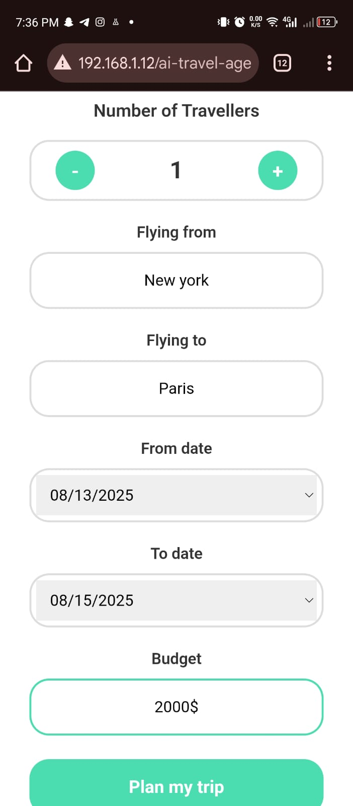
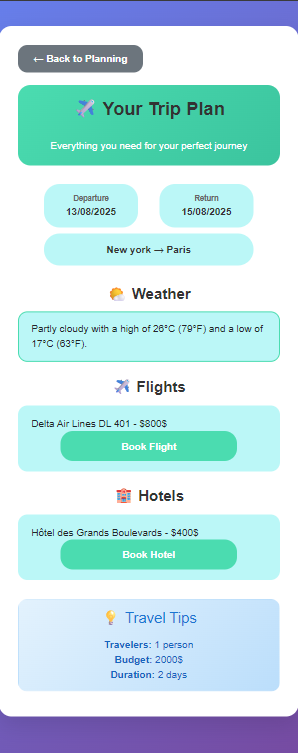

# ✈️ AI Travel Agent

An intelligent travel planning application that uses AI to generate personalized travel plans with realistic flight, hotel, and weather information.

## 🚀 Features

- **AI-Powered Travel Planning**: Generate realistic travel plans using OpenAI GPT-4
- **Smart Route Detection**: Automatically suggests appropriate airlines for different routes
- **Realistic Data**: AI generates realistic hotel names, prices, and weather information
- **Responsive Design**: Beautiful, modern UI that works on all devices
- **Real-time Planning**: Get instant travel recommendations based on your preferences

## 📸 Screenshots

### Landing Page

*Welcome to the AI Travel Agent - Start planning your next adventure*

### Trip Planning Form

*Easy-to-use form to input your travel preferences and budget*

### Generated Trip Plan

*AI-generated travel plan with realistic flight, hotel, and weather information*

### Mobile Responsive Design



*Perfect experience on all devices - mobile, tablet, and desktop*

## 🛠️ Technology Stack

- **Frontend**: HTML5, CSS3, JavaScript (ES6+)
- **Backend**: Node.js, Express.js
- **AI Integration**: OpenAI GPT-4 API
- **Styling**: Bootstrap 5
- **Data Storage**: Local Storage

## 📋 Prerequisites

- Node.js (v14 or higher)
- OpenAI API Key
- Modern web browser

## 🚀 Installation

1. **Clone the repository**:
   ```bash
   git clone https://github.com/MHMD304/ai-travel-agent
   cd ai-travel-agent
   ```

2. **Install dependencies**:
   ```bash
   npm install
   ```

3. **Create environment file**:
   ```bash
   cp .env.example .env
   ```
   
   Add your OpenAI API key to `.env`:
   ```
   OPENAI_API_KEY=your_api_key_here
   ```

4. **Start the server**:
   ```bash
   node server.js
   ```

5. **Open the application**:
   Navigate to `http://localhost:3000` in your browser

## 📱 Usage

1. **Open the application** in your browser
2. **Enter travel details**:
   - Number of travelers
   - Departure city
   - Destination city
   - Travel dates
   - Budget
3. **Click "Plan my trip"**
4. **View your personalized travel plan** with:
   - Flight information
   - Hotel recommendations
   - Weather forecasts
   - Trip duration
   - Cost breakdown

## 🌟 Key Features

### **Smart Airline Selection**
- **Middle East Routes**: MEA, Royal Jordanian, Turkish Airlines
- **European Routes**: Air France, Lufthansa, British Airways
- **Asian Routes**: Emirates, Qatar Airways, Singapore Airlines

### **Realistic Hotel Data**
- AI generates hotel names that actually exist in the destination
- Realistic pricing based on location and travel dates
- Amenities and location information

### **Accurate Weather Information**
- Weather forecasts based on destination and travel dates
- Seasonal considerations
- Temperature ranges and conditions

## 🔧 Configuration

### **Environment Variables**
- `OPENAI_API_KEY`: Your OpenAI API key
- `PORT`: Server port (default: 3000)

### **AI Model Settings**
- Model: GPT-4o-mini
- Temperature: 0.7 (balanced creativity and consistency)

## 📁 Project Structure

```
ai-travel-agent/
├── index.html          # Landing page
├── letsBegin.html      # Trip planning form
├── trip.html          # Trip results display
├── server.js          # Backend server
├── script.js          # Frontend logic
├── style.css          # Main styles
├── letsBegin.css      # Planning page styles
├── trip.css           # Results page styles
├── package.json       # Dependencies
├── .env               # Environment variables
└── README.md          # This file
```

## 🎨 UI Components

- **Modern Gradient Backgrounds**: Beautiful visual appeal
- **Responsive Cards**: Clean information display
- **Interactive Buttons**: Smooth hover effects
- **Professional Typography**: Easy-to-read fonts
- **Mobile-First Design**: Works perfectly on all devices

## 🔒 Security

- API keys stored in environment variables
- CORS enabled for development
- Input validation on both frontend and backend
- Secure data handling

## 🚀 Deployment

### **Local Development**
```bash
npm install
node server.js
```

### **Production Deployment**
1. Set up environment variables
2. Use PM2 or similar process manager
3. Configure reverse proxy (nginx)
4. Set up SSL certificates

## 🤝 Contributing

1. Fork the repository
2. Create a feature branch
3. Make your changes
4. Test thoroughly
5. Submit a pull request

## 📄 License

This project is licensed under the MIT License - see the [LICENSE](LICENSE) file for details.

## 🙏 Acknowledgments

- OpenAI for providing the GPT-4 API
- Bootstrap team for the amazing CSS framework
- The open-source community for inspiration

## 📞 Support

If you encounter any issues or have questions:
- Create an issue on GitHub
- Check the troubleshooting section
- Review the code comments

## 🔮 Future Enhancements

- [ ] User authentication and profiles
- [ ] Save favorite travel plans
- [ ] Integration with real booking APIs
- [ ] Multi-language support
- [ ] Advanced filtering options
- [ ] Travel itinerary export
- [ ] Social sharing features

---

**Made with ❤️ for travelers around the world**
